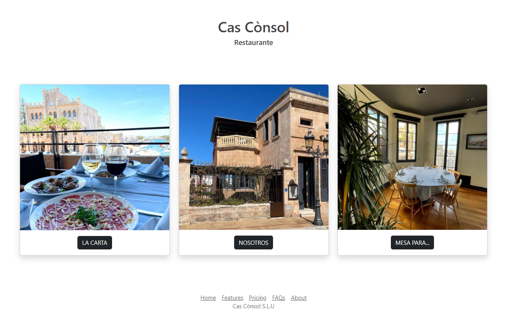
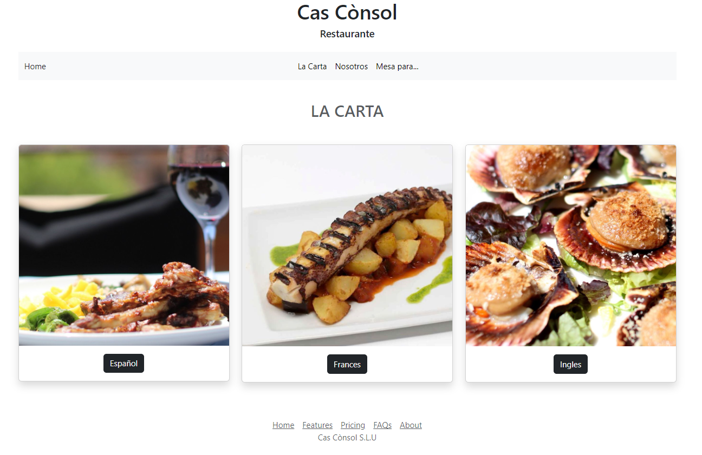
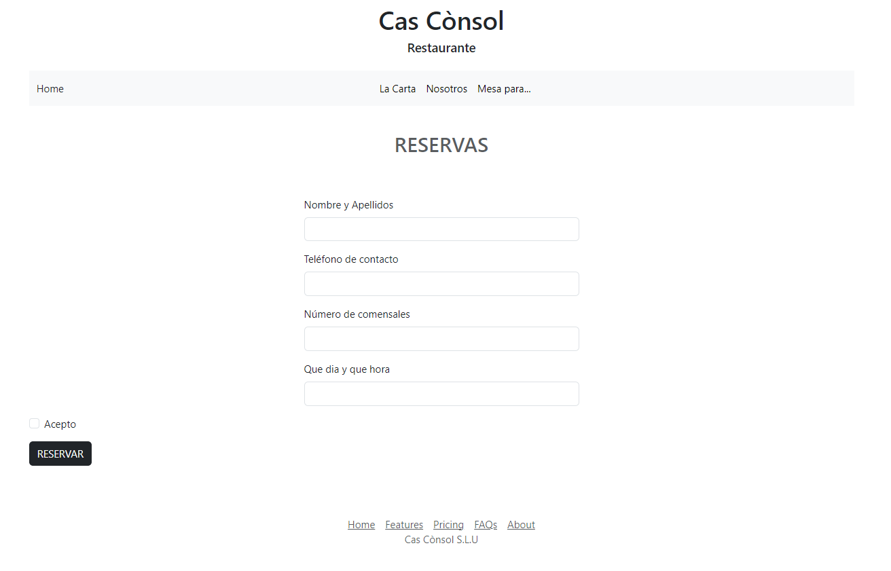

# CasConsol Restaurante


<details>
  <summary>Contenido 📝</summary>
  <ol>
    <li><a href="#objetivo">Objetivo</a></li>
    <li><a href="#sobre-el-proyecto">Sobre el proyecto</a></li>
    <li><a href="#stack">Stack</a></li>
    <li><a href="#vistas">Vistas</a></li>
    <li><a href="#contribuciones">Contribuciones</a></li>
    <li><a href="#licencia">Licencia</a></li>
    <li><a href="#desarrollo">Desarrollo</a></li>
    <li><a href="#contacto">Contacto</a></li>
  </ol>
</details>

## Objetivo
Este proyecto exigía el desarrollo de una carta de restaurante, la cual debía ser responsive y se valoraba la inclusión de múltiples páginas.
El objetivo de este repositorio es presentar mi primer proyecto realizado con GeeksHubs Academy. 

## Sobre el proyecto
Opté por desarrollar un proyecto centrado en el restaurante familiar, en el cual incluí el menú en tres idiomas diferentes, acompañado de páginas de inicio, reservas, sobre nosotros y navegación integral entre páginas.


## Stack
Tecnologías utilizadas:
<div align="center">
<a href="">
    
</a>

</div>

## Vistas
Principal
  
Menú

Reserva



## Contribuciones
Las sugerencias y aportaciones son siempre bienvenidas.  

Puedes hacerlo de dos maneras:

1. Abriendo una issue
2. Crea un fork del repositorio
    - Crea una nueva rama  
        ```
        $ git checkout -b feature/nombreUsuario-mejora
        ```
    - Haz un commit con tus cambios 
        ```
        $ git commit -m 'feat: mejora X cosa'
        ```
    - Haz push a la rama 
        ```
        $ git push origin feature/nombreUsuario-mejora
        ```
    - Abre una solicitud de Pull Request


## Licencia
Este proyecto se encuentra bajo licencia de "BartoPons"


## Desarrollo:

``` js
 const developer = "BartoPons";


```  


## Contacto
<a href = "mailto:ponsbarto@gmail.com"></a>
<a href="https://www.linkedin.com/in/bartomeu-pons-mascar%C3%B3-4594a81b6/" target="_blank"></a> 
</p>